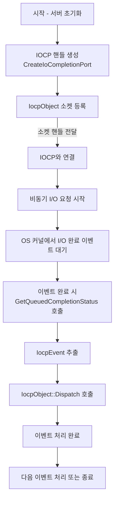
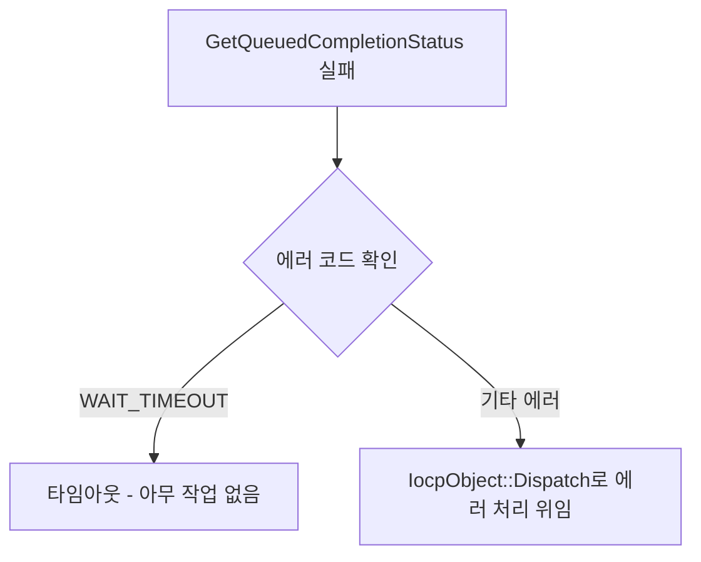

# 🧵 IOCP 기반 비동기 네트워크 서버 구조

이 프로젝트는 Windows의 IOCP(I/O Completion Port)를 활용하여 고성능 비동기 네트워크 서버를 구현합니다.

## 구성 요소

- **`IocpObject`**
  - IOCP에서 사용할 키(Key) 역할을 하며, `GetHandle()`과 `Dispatch()`를 순수 가상 함수로 갖는 베이스 클래스입니다.
  - 이 객체를 IOCP에 등록합니다.

- **`IocpCore`**
  - `CreateIoCompletionPort()`를 통해 IOCP 핸들을 생성 및 관리합니다.
  - `Dispatch()`를 통해 `GetQueuedCompletionStatus()`로 이벤트를 받아 처리합니다.
  - `Register()` 함수로 `IocpObject`를 IOCP에 연결합니다.

- **`IocpEvent`**
  - 실제 Overlapped 구조체 기반의 이벤트 정보를 담는 클래스입니다.
  - 이벤트가 완료되면 `Dispatch()`를 통해 원 소유자(`IocpObject`)에게 전달됩니다.

---

## 🌐 전체 처리 흐름

---

## 🔄 예외 처리 흐름

---

## ✅ 기타 참고

- IOCP는 높은 동시성을 지원하며, 이벤트 기반 구조 덕분에 불필요한 스레드 사용 없이도 높은 성능을 발휘합니다.
- `shared_from_this()`를 이용한 스마트 포인터 사용으로 객체 생명 주기를 안정적으로 관리합니다.
